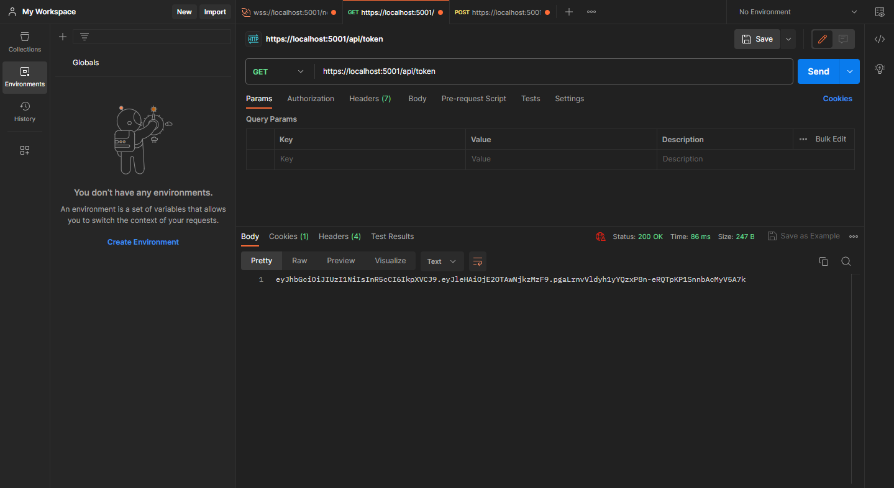
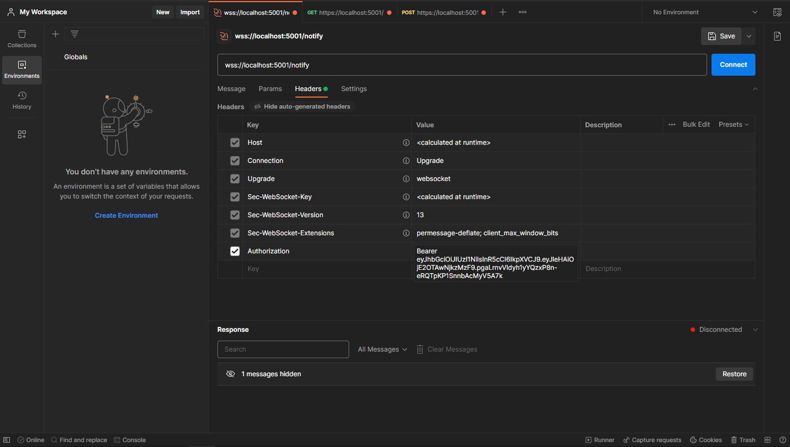
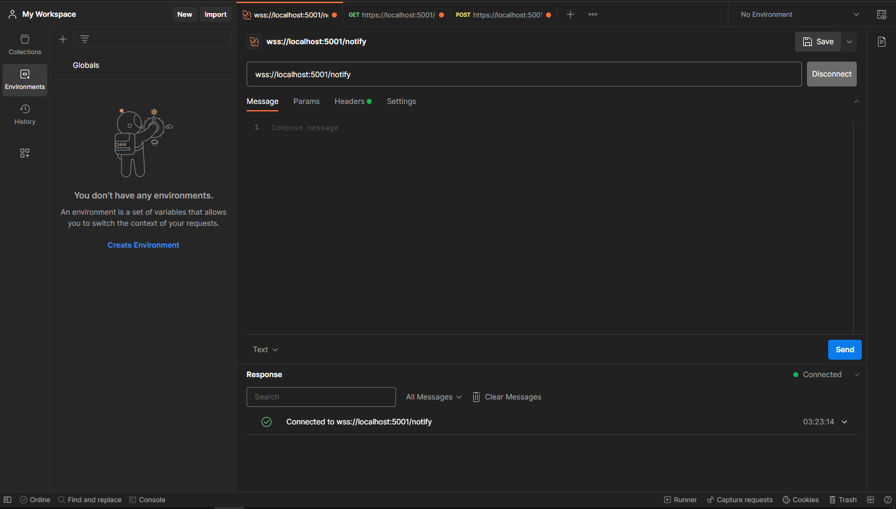
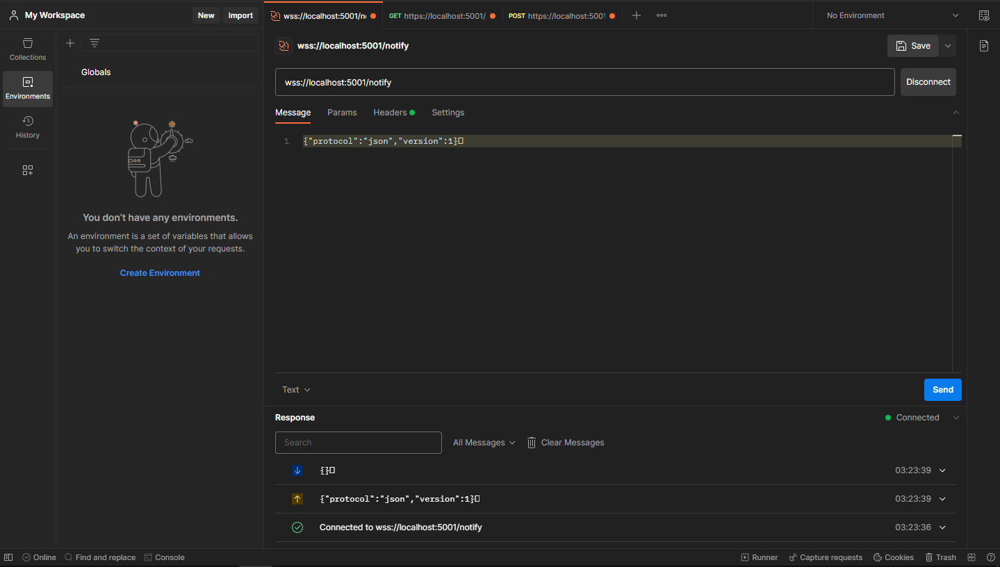
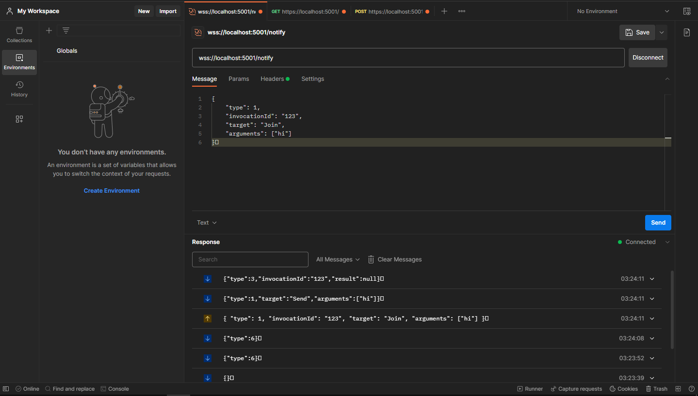

# Yarp SignalR Sample

### YarpSignalRSample.ReverseProxy url: https://localhost:5001
### YarpSignalRSample.SignalR url: https://localhost:6001

### Steps:
1. Get the token using the url  https://localhost:5001/api/token or https://localhost:6001/api/token
2. Set the header Authorization: Bearer {your token}
3. Try to connect wss://localhost:5001/notify
4. After connecting, you need to send a message {"protocol":"json","version":1} ([Read more](https://github.com/dotnet/aspnetcore/blob/main/src/SignalR/docs/specs/HubProtocol.md#json-encoding))
5. Send a message {
   "type": 1,
   "invocationId": "123",
   "target": "Join",
   "arguments": ["hi"]
   }

I want to point out that strange symbol at the end of the message. I don't know why, but nothing will work without this symbol.

## Screenshots:

